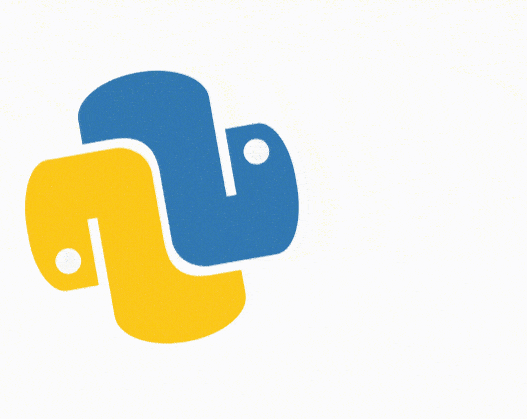

# :snake: PYTHON PROBLEM SOLVING CHIEF :snake:

Welcome to my personal solutions for coding-challenges in Python. Thanks for visiting and wish you a great day!

> "The joy of coding Python should be in seeing short, concise, readable classes that express a lot of action in a small amount of clear code -- not in reams of trivial code that bores the reader to death." - Guido van Rossum

 

 

 

Some great advanced courses/lectures that helped me to improve my problem-solving skills, algorithmic thinking, data structures and dynamic programming optimizations are:

- [MIT 6.006 Introduction to Algorithms, Fall 2011](https://youtube.com/playlist?list=PLUl4u3cNGP61Oq3tWYp6V_F-5jb5L2iHb)
- [MIT 6.046J Design and Analysis of Algorithms, Spring 2015](https://youtube.com/playlist?list=PLUl4u3cNGP6317WaSNfmCvGym2ucw3oGp)
- [MIT 6.854 (Advanced Algorithms), Spring 2016](https://youtube.com/playlist?list=PL6ogFv-ieghdoGKGg2Bik3Gl1glBTEu8c)
- [Dynamic Programming - Andrey Grehov](https://youtube.com/playlist?list=PLVrpF4r7WIhTT1hJqZmjP10nxsmrbRvlf)
- [Dynamic Programming - Learn to Solve Algorithmic Problems & Coding Challenges](https://youtu.be/oBt53YbR9Kk)

Most of the problems of this repository come from public coding sites, such as:

- [LeetCode](https://leetcode.com/problemset/all/)
- [CodeSignal](https://app.codesignal.com)
- [HackerRank](https://www.hackerrank.com/dashboard)
- [ProjectEuler](https://projecteuler.net/archives)

The challenges that you will find on this project are my custom solutions, so feel free to use them as a guide for your future projects but don't expect them to be absolutely perfect (as I am learning new optimizations techniques every day)!.  

## Coding Challenges :cloud:

These are coding problems that are usually related to competitive programming in which a specific set of Inputs/Outputs are specified and Memory/CPU constraints are added.

## Dependencies :vertical_traffic_light:

### Software dependencies (based on project)

- [Visual Studio Code](https://code.visualstudio.com/)  
  Visual Studio Code is my main code editor for high-level programming. This is not absolutely necessary, but from my experience, it gives us a great performance and we can link it with Git and GitHub easily.  

- [Python](https://www.python.org/)  
  Python is an amazing dynamic programming language that let us work fast, with easy and powerful integration of different software solutions.  

### Libraries and Package dependencies (based on project)

- [None]().  
  All of these challenges are developed with the built-in libraries and do not require any external dependency.  

## Usage :dizzy:

All projects are well commented/documented and most of them have specifications and remarks for their purpose and I/O.  

I will be uploading the necessary files, and try to keep it as clean as possible.  

## Special thanks :gift:

- Thanks to all contributors of the great OpenSource projects that I am using.  

## Author :musical_keyboard:

### Santiago Garcia Arango

<table border="1">
    <tr>
        <td>
            
Senior DevOps Engineer passionate about advanced cloud-based solutions and deployments in AWS. I am convinced that today's greatest challenges must be solved by people that love what they do.

        </td>
        <td>
            

        </td>
    </tr>
</table>
